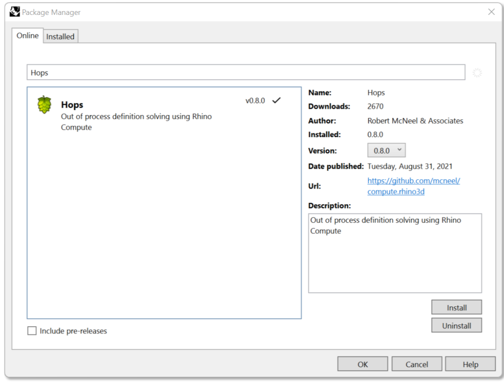
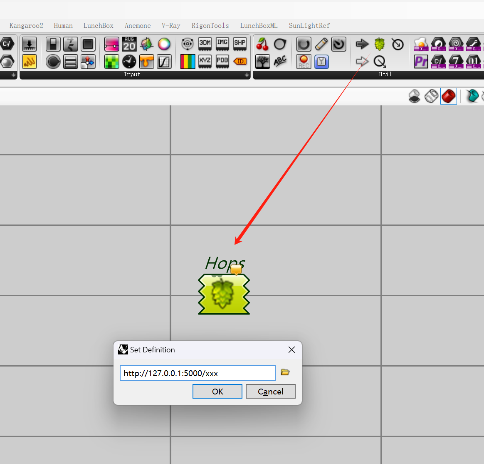

# Gh-Hops-Tectonics

## Install
### Type 'PackageManager' on the Rhino Command line.
- Then,search for "Hops"
- Select Hops and then install

### Install Python(CPython 3.8 or above)
### Install Visual Studio Code(recommended)
### Clone Project
```
$ git clone https://github.com/rigoncs/Gh-Hops-Tectonics.git
$ cd Gh-Hops-Tectonics
$ python-m venv your_venv_name
$ pip install -r requirements.txt
```
### Runnning
```
$ python .\app.py #启动flask
```

Double click to input url.
"xxx" is the path of the function corresponding to the flask server.For example, the url of the function in the following screenshot is "http://127.0.0.1:5000/greymesh".
